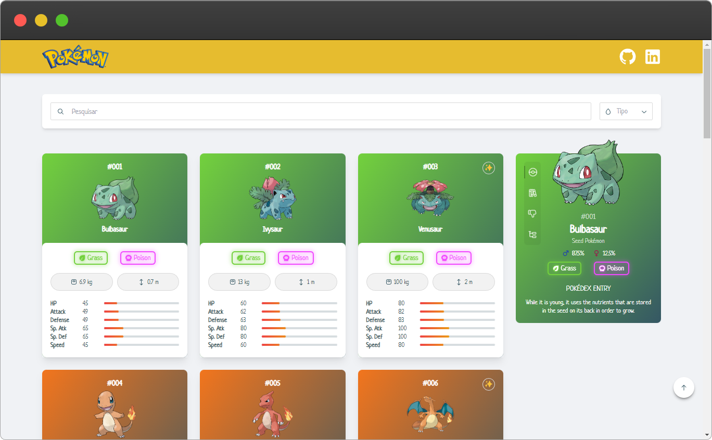

<h1 align="center">
💻 Pokédex
</h1>

<div align="center">

Pokédex created with ReactJS + TypeScript, using vite as boilerplate and tailwind CSS as customization library.
Tailwind is used to manipulate the page's css and customize the <a href="https://www.radix-ui.com">Radix UI</a> components,
the <a href="https://icons.radix-ui.com">Radix UI Icons</a> library is used to compose some of the basic screen icons and
<a href="https://pokeapi.co">PokeApi</a> as the api for data consumption.


  
  <br />
  <br />
</div>

<h2>🗒️ Index</h2>

- [🚀 Technologies](#-technologies)
- [✨ Features](#-features)
- [📦 Install](#-install)
- [🔨 Build](#-build)
- [🔍 Preview](#-preview)
- [⭐ Credits](#-credits)
- [🔗 Links](#-links)
- [📝 License](#-license)

## 🚀 Technologies

- 🔩 React
- 💡 TypeScript
- ⚡ Vite
- 🌈 Tailwind CSS
- 🔥 PokéApi

## ✨ Features

- 🔎 Search pokemon by name
- 📱 Responsiveness
- 📄 Pagination
- ✨ Shape change
- 👁️‍🗨️ Icon change

## 📦 Install

📝 Install the dependencies and **start** the project

```bash
yarn install
yarn run dev
```

## 🔨 Build

📝 **Build** the application for **production**

```bash
yarn run build
```

## 🔍 Preview

📝 Preview the build

```bash
yarn run preview
```

## ⭐ Credits

- [Loading](https://codepen.io/tiffachoo/pen/WNxEJZP)

## 🔗 Links

- [Vite](https://vitejs.dev/)
- [Github](https://github.com/andersonsrocha)
- [LinkedIn](https://www.linkedin.com/in/anderson-silva-a40926192)

## 📝 License

This project is under the MIT license. See the [LICENSE](LICENSE) file for more details.
